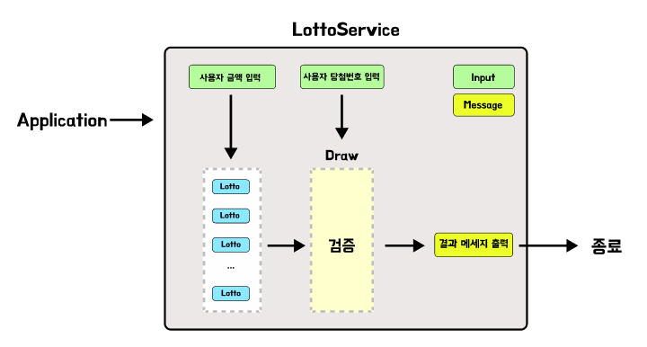

## 🎯 구현할 기능 목록

<details>
    <summary>게임 진행순서</summary>
    <div markdown="1">

1. `구입금액을 입력해 주세요.`
    - 로또 구입 금액을 입력
        - ex) `14000`
    - 1000원 단위로 떨어져야 하며 그렇지 않을시 `IllegalArgumentException`
    - <u>사용자의 입력을 받은 후 공백 출력</u>

<br>

2. `__개를 구매했습니다.`
    - 결과값은 `구입금액/1000`
    - 로또번호를 `(구입금액/1000)`번 생성 및 출력
        - ex) `[8, 21, 23, 41, 42, 43] `
    - 로또 번호의 숫자 범위는 1~45까지이다.
    - 1개의 로또를 발행할 때 중복되지 않는 6개의 숫자를 뽑는다.
    - <u>로또 번호를 모두 출력한 다음 공백 출력</u>

<br>

3. `당첨 번호를 입력해 주세요.`    
    - 서로 다른 6개의 숫자를 쉽표와 함께 입력
        - ex) `1,2,3,4,5,6`
    - <u>사용자의 입력을 받은 후 공백 출력</u>

<br>
 
4. `보너스 번호를 입력해 주세요.`
    - 당첨 번호와 중복되지 않는 번호를 추가로 입력
        - ex) `7`
   - <u>사용자의 입력을 받은 후 공백 출력</u>

<br>

5. `당첨 통계`
    - 다음줄에 `---` 를 출력
    - 그리고 다음줄에 당첨 내역을 출력
    
        ```
        3개 일치 (5,000원) - _개
        4개 일치 (50,000원) - _개
        5개 일치 (1,500,000원) - _개
        5개 일치, 보너스 볼 일치 (30,000,000원) - _개
        6개 일치 (2,000,000,000원) - _개
        ```
        - 생성한 로또 번호와 입력값을 비교하여 해당하는 일치 번호갯수 줄의 `_` 부분에 넣어서 출력

<br>

6. `총 수익률은 __%입니다.`
    - 수익률은 `당첨금액 / 구매금액` 의 결과값을 소수점 둘째 자리에서 반올림

<br>

- 입력값 에러 발생 시 `IllegalArgumentException` 와 함께 에러 문구를 출력
    - ex) `[ERROR] 로또 번호는 1부터 45 사이의 숫자여야 합니다.`
    - 에러 문구는 항상 "[ERROR]" 로 시작
    


<br>

- 게임 전체 메세지 출력 예시
   ```
   구입금액을 입력해 주세요.
   8000
   
   8개를 구매했습니다.
   [8, 21, 23, 41, 42, 43]
   [3, 5, 11, 16, 32, 38]
   [7, 11, 16, 35, 36, 44]
   [1, 8, 11, 31, 41, 42]
   [13, 14, 16, 38, 42, 45]
   [7, 11, 30, 40, 42, 43]
   [2, 13, 22, 32, 38, 45]
   [1, 3, 5, 14, 22, 45]
   
   당첨 번호를 입력해 주세요.
   1,2,3,4,5,6
   
   보너스 번호를 입력해 주세요.
   7
   
   당첨 통계
   ---
   3개 일치 (5,000원) - 1개
   4개 일치 (50,000원) - 0개
   5개 일치 (1,500,000원) - 0개
   5개 일치, 보너스 볼 일치 (30,000,000원) - 0개
   6개 일치 (2,000,000,000원) - 0개
   총 수익률은 62.5%입니다.
   ```

    </div>

</details>

<div align="center">
    
</div>

<br>

- `domain` 패키지
    - `Lotto` : 사용자가 입력한 금액의 천원마다 생생하는 로또 객체 
    - `Draw` : 각 로또 객체와 생성한 숫자에 대한 결과를 만드는 객체


- `service` 패키지
    - `LottoService` : 사용자의 금액 입력부터 메세지 출력까지 모든것을 관리하는 클래스
   

- `util` 패키지
    - `Input` : 사용자의 입력을 담당하는 클래스
    - `Message` : 로또추첨을 진행하면서 출력하는 메세지들을 담당하는 클래스


- `validaition` 패키지 
    - `MoneyValidation` : 사용자의 입력값이 올바른 금액인지 검증하는 클래스
    - `NumberValidation` : 사용자가 입력한 숫자들이 올바른 당첨 숫자인지 검증하는 클래스
      

<br>